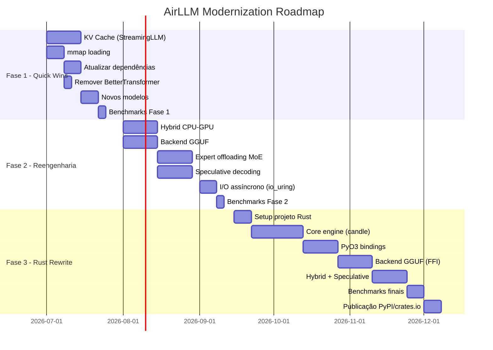

# Plano de Modernização do AirLLM

> **Data**: 2026-06-27
> **Autor**: EdgeSearch Orquestrador
> **Status**: Proposta — Aguardando aprovação
> **Baseline**: AirLLM v2.11.0 (Agosto 2024)

---

## 1. Diagnóstico — Por que o AirLLM está defasado

### 1.1 Problemas Críticos Identificados

| # | Problema | Impacto | Severidade |
|---|---|---|---|
| P1 | **KV Cache desativado** (`use_cache = False` para transformers novos) | Recomputação total a cada token gerado — perda de 10-50x na geração | 🔴 Crítico |
| P2 | **I/O síncrono camada por camada** via `load_file()` do safetensors | Python GDL bottleneck, sem aproveitar mmap do SO | 🔴 Crítico |
| P3 | **Sem execução híbrida CPU-GPU** — CPU fica ociosa durante GPU compute | Wasted CPU compute que poderia paralelizar | 🟡 Alto |
| P4 | **Quantização obsoleta** — usa bitsandbytes 4bit/8bit (NF4/block-wise) | Inferior a GGUF k-quants, AWQ, GPTQ em qualidade e velocidade | 🟡 Alto |
| P5 | **Dependências desatualizadas** — `requirements.txt` com versões pinadas de 2023 | `accelerate==v0.20.3`, `peft==v0.3.0`, `bitsandbytes==0.39.0` — todas defasadas | 🟡 Alto |
| P6 | **BetterTransformer deprecated** — removido do `optimum` desde 2024 | Código tenta usar e cai em fallback silencioso | 🟠 Médio |
| P7 | **Sem suporte a modelos recentes** — DeepSeek-V3, Llama3.3, Qwen3, Gemma2, Phi-4 | Apenas 8 arquiteturas suportadas, todas de 2023-2024 | 🟠 Médio |
| P8 | **Sem speculative decoding** | Não aproveita draft models para 2-3x speedup | 🟠 Médio |
| P9 | **MoE: carrega todos os experts** | Para Mixtral 8x7B, carrega 8 experts quando só 2 são ativados — 4x desperdício | 🟠 Médio |
| P10 | **Sem suporte a Flash Attention 2/3** | Usa `sdpa` como fallback, não FA2 nativo | 🟢 Baixo |

### 1.2 Comparação com o Estado da Arte (2025-2026)

| Métrica | AirLLM v2.11.0 | llama.cpp (2025) | vLLM (2025) |
|---|---|---|---|
| Tokens/sec (70B Q4, 4GB VRAM) | < 1 token/sec | 2-10 tokens/sec | N/A (não suporta) |
| Formato de modelo | safetensors (fp16) | GGUF (k-quants + imatrix) | safetensors (AWQ/GPTQ) |
| Carregamento | Explícito por camada | mmap (zero-copy) | RAM residente |
| KV Cache | ❌ Desativado | ✅ Em RAM | ✅ PagedAttention |
| CPU-GPU híbrido | ❌ | ✅ `n_gpu_layers` | ❌ |
| Modelos suportados | 8 arquiteturas | 100+ arquiteturas | 50+ arquiteturas |
| Speculative decoding | ❌ | ✅ | ✅ |
| MoE expert offloading | ❌ | ✅ | ✅ |

---

## 2. Análise de Alternativas

### 2.1 Bibliotecas que podem SUBSTITUIR o AirLLM

| Biblioteca | Linguagem | Por que substitui | Trade-off |
|---|---|---|---|
| **llama.cpp** | C/C++ | mmap + GGUF k-quants + híbrido CPU-GPU. 10-50x mais rápido. Padrão da indústria. | Requer quantização (GGUF). AirLLM preserva fp16. |
| **llama-cpp-python** | Python (bindings) | Mesmo de cima com API Python. Pode ser drop-in replacement. | Mesmo trade-off de quantização. |
| **PowerInfer** | C++/Python | Offloading em nível de neurônio (não camada). 10x+ speedup para MoE. | Complexidade maior, foco em MoE. |
| **ExLlamaV2** | Python/CUDA | EXL2 quantization (bitrate variável). Extremamente rápido em NVIDIA. | Apenas NVIDIA. Não suporta 4GB extremo. |
| **mistral.rs** | Rust | Suporta safetensors + GGUF. Candle backend. Zero-overhead Rust. | Ecossistema menor. |

### 2.2 Bibliotecas que COMPLEMENTAM o AirLLM

| Biblioteca | Como complementa |
|---|---|
| **HuggingFace Accelerate** | Já é dependência. `device_map="auto"` + hooks de offload podem substituir o gerenciamento manual de camadas |
| **DeepSpeed ZeRO-Inference** | Estratégias de particionamento e async I/O para NVMe podem inspirar melhorias |
| **candle (Rust)** | Backend de alta performance para uma reescrita em Rust |
| **MLX / mlx-lm** | Já integrado, mas deve ser atualizado para mlx-lm nativo em vez de implementação custom |

### 2.3 Tecnologias-chave emergidas pós-Agosto 2024

| Tecnologia | Descrição | Impacto no AirLLM |
|---|---|---|
| **GGUF k-quants + imatrix** | Quantização variável por tensor com calibração por importância | Substituiria bitsandbytes por algo 2-4x melhor |
| **mmap de modelos** | OS gerencia paging disk→RAM transparentemente, zero-copy | Eliminaria `load_layer_to_cpu()` inteiro |
| **Flash Attention 2/3** | Atenção O(n) em vez de O(n²) | Substituir BetterTransformer deprecated |
| **Speculative decoding** | Draft model propõe tokens, modelo grande verifica em paralelo | 2-3x throughput |
| **StreamingLLM / H2O** | Compressão de KV cache (attention sinks + sliding window) | Viabilizaria KV cache sem estourar RAM |
| **Expert offloading (MoE)** | Carregar apenas experts ativados (~2 de 8) | 4x redução em I/O para Mixtral |
| **PagedAttention** | KV cache em páginas fixas, sem fragmentação | Essencial se virar servidor |

---

## 3. Plano de Modernização — 3 Fases

### Fase 1: Quick Wins (2-4 semanas) — Manter Python, corrigir o crítico

**Objetivo**: Corrigir os problemas mais graves sem mudar a arquitetura.

#### 1.1 Habilitar KV Cache com StreamingLLM

```python
# Problema atual (airllm_base.py, linha ~430):
if cache_utils_installed:
    use_cache = False  # ❌ desativa completamente

# Solução: implementar KV cache em RAM com compressão StreamingLLM
# - Manter attention sinks (primeiros N tokens) + sliding window
# - Memória O(1) em vez de O(n)
```

**Arquivos a modificar**:
- `airllm_base.py` — Reimplementar `forward()` com KV cache persistente
- Novo arquivo: `kv_cache.py` — Implementação de StreamingLLM cache

#### 1.2 Substituir `load_file()` por mmap

```python
# Problema atual (utils.py):
layer_state_dict = load_file(Path(local_path) / (layer_name + ".safetensors"), device="cpu")

# Solução: usar safetensors com mmap
from safetensors import safe_open
with safe_open(path, framework="pt", device="cpu") as f:
    # mmap automático pelo SO
```

**Arquivos a modificar**:
- `persist/safetensor_model_persister.py` — Usar `safe_open` com mmap
- `utils.py` — `load_layer()` usar mmap

#### 1.3 Atualizar Dependências

```toml
# pyproject.toml (substituir setup.py)
[project]
dependencies = [
    "torch>=2.4",
    "transformers>=4.46",
    "accelerate>=1.0",
    "safetensors>=0.4",
    "huggingface-hub>=0.26",
    "bitsandbytes>=0.44",  # opcional
    "scipy>=1.14",
]
# Remover: optimum (BetterTransformer deprecated)
# Remover: PostInstallCommand hack
```

#### 1.4 Remover BetterTransformer, usar Flash Attention 2 nativo

```python
# Problema atual:
from optimum.bettertransformer import BetterTransformer  # ❌ deprecated

# Solução:
# transformers 4.46+ já usa Flash Attention 2 nativamente via:
config.attn_implementation = "flash_attention_2"
```

#### 1.5 Adicionar suporte a modelos recentes

- DeepSeek-V2/V3 (MoE com shared experts)
- Llama 3.2/3.3
- Qwen 3
- Gemma 2
- Phi-4

**Entregáveis da Fase 1**:
- [ ] KV cache habilitado com StreamingLLM
- [ ] mmap substituindo `load_file()`
- [ ] Dependências atualizadas (pyproject.toml)
- [ ] BetterTransformer removido, FA2 nativo
- [ ] 5+ novos modelos suportados
- [ ] Benchmarks comparando antes/depois

---

### Fase 2: Reengenharia (4-8 semanas) — Performance e Arquitetura

**Objetivo**: Mudanças arquiteturais para fechar a gap com llama.cpp.

#### 2.1 Execução Híbrida CPU-GPU

Em vez de carregar cada camada para GPU, executar e liberar:
- Manter N camadas residentes na GPU (configurável)
- Executar camadas restantes na CPU em paralelo
- Pipeline: GPU processa camada N enquanto CPU processa camada N+1

```python
class HybridExecutionConfig:
    n_gpu_layers: int = 16  # camadas residentes na GPU
    cpu_threads: int = os.cpu_count()
    # Camadas além de n_gpu_layers rodam na CPU
```

#### 2.2 Suporte a GGUF (opcional — manter compatibilidade)

Adicionar um backend GGUF que usa `llama-cpp-python` internamente:

```python
from airllm import AutoModel

# Mantém API original (safetensors fp16)
model = AutoModel.from_pretrained("meta-llama/Llama-3-70B")

# Novo: modo GGUF (quantizado, 10x mais rápido)
model = AutoModel.from_pretrained("meta-llama/Llama-3-70B-Q4_K_M.gguf",
                                  backend="gguf")
```

#### 2.3 Expert Offloading para MoE

Para Mixtral/DeepSeek:
- Identificar experts ativados pelo router
- Carregar apenas experts ativados para GPU
- Cache LRU de experts recentes na GPU

```python
class MoEExpertCache:
    def __init__(self, max_experts_in_gpu=4):
        self.lru_cache = OrderedDict()
        self.max_size = max_experts_in_gpu
    
    def get_expert(self, expert_idx, layer_idx):
        # Carrega apenas o expert necessário
        # Mantém recentes em cache
```

#### 2.4 Speculative Decoding

```python
# Draft model pequeno (1-3B) roda inteiro na GPU
# Modelo grande faz verificação camada por camada
draft_model = AutoModel.from_pretrained("meta-llama/Llama-3-1B")  # GPU
target_model = AutoModel.from_pretrained("meta-llama/Llama-3-70B")  # layer-wise

# Gera K tokens com draft model
# Verifica em paralelo com target model
# Aceita tokens corretos, rejeita e regenera a partir do primeiro erro
```

#### 2.5 Profiling e Otimização de I/O

- Substituir `ThreadPoolExecutor` por `asyncio` com `aiofiles`
- Usar `io_uring` no Linux para I/O assíncrono de baixo overhead
- Pinned memory + CUDA streams para transferência H2D assíncrona

**Entregáveis da Fase 2**:
- [ ] Execução híbrida CPU-GPU
- [ ] Backend GGUF opcional
- [ ] Expert offloading para MoE
- [ ] Speculative decoding
- [ ] I/O assíncrono com io_uring
- [ ] Benchmarks comparando com llama.cpp

---

### Fase 3: Reescrita em Rust (8-16 semanas) — Estado da arte

**Objetivo**: Reescrever o core em Rust usando `candle` como backend, mantendo Python bindings via PyO3.

#### 3.1 Por que Rust?

| Aspecto | Python (atual) | Rust (proposto) |
|---|---|---|
| Overhead de runtime | GIL, GC, interpretação | Zero-cost abstractions |
| Memória | GC imprevisível | Ownership determinístico |
| Concorrência | GDL limita paralelismo | `tokio` + `rayon` sem overhead |
| I/O assíncrono | asyncio (single-thread) | `tokio` (multi-core async) |
| Tipos | Duck typing, erros em runtime | Type system, erros em compile |
| Distribuição | pip + dependências | Single binary + Python wheel |

#### 3.2 Arquitetura Proposta (Rust)

```
airllm-rs/
├── crates/
│   ├── airllm-core/          # Core em Rust
│   │   ├── src/
│   │   │   ├── lib.rs
│   │   │   ├── model.rs       # Trait ModelLoader
│   │   │   ├── layer.rs       # Layer-wise inference engine
│   │   │   ├── mmap.rs        # Memory-mapped loading
│   │   │   ├── kv_cache.rs    # StreamingLLM KV cache
│   │   │   ├── moe.rs         # Expert offloading
│   │   │   ├── speculative.rs # Speculative decoding
│   │   │   ├── hybrid.rs      # CPU-GPU hybrid execution
│   │   │   └── profiler.rs     # Profiling
│   │   └── Cargo.toml
│   ├── airllm-candle/        # Backend candle (HuggingFace)
│   │   └── src/
│   │       └── backend.rs
│   ├── airllm-gguf/          # Backend GGUF (llama.cpp bindings)
│   │   └── src/
│   │       └── backend.rs
│   └── airllm-python/        # Python bindings (PyO3)
│       └── src/
│           └── lib.rs        # Exporta para Python
├── python/
│   └── airllm/               # Package Python (wrapper)
│       ├── __init__.py
│       └── auto_model.py     # AutoModel API compatível
├── benches/                  # Benchmarks (criterion)
├── tests/
└── Cargo.toml
```

#### 3.3 API Python Compatível (via PyO3)

```python
# API permanece idêntica — usuário não percebe a mudança
from airllm import AutoModel

model = AutoModel.from_pretrained("meta-llama/Llama-3-70B",
                                  backend="candle",  # ou "gguf"
                                  compression="4bit",
                                  hybrid=True,        # CPU-GPU híbrido
                                  n_gpu_layers=32,    # camadas na GPU
                                  kv_cache="streaming",  # StreamingLLM
                                  speculative=True,   # speculative decoding
                                  draft_model="meta-llama/Llama-3-1B")
```

#### 3.4 Backend Strategy

| Backend | Quando usar | Implementação |
|---|---|---|
| `candle` | Modelos safetensors (fp16, sem quantização) | Nativo Rust via candle |
| `gguf` | Modelos quantizados (Q4_K_M, etc.) | Bindings para llama.cpp via FFI |
| `mlx` | Apple Silicon | mlx-rs bindings |

**Entregáveis da Fase 3**:
- [ ] Core em Rust com candle
- [ ] Python bindings via PyO3
- [ ] Backend GGUF via llama.cpp FFI
- [ ] mmap nativo em Rust
- [ ] KV cache com StreamingLLM
- [ ] Hybrid CPU-GPU com rayon
- [ ] Speculative decoding
- [ ] Benchmarks: AirLLM-Rust vs llama.cpp vs AirLLM-Python
- [ ] Publicação no PyPI e crates.io

---

## 4. Roadmap Visual



---

## 5. Matriz de Decisão — Caminho Recomendado

| Critério | Fase 1 apenas | Fase 1+2 | Fase 1+2+3 |
|---|---|---|---|
| Esforço | Baixo (2-4 sem) | Médio (4-8 sem) | Alto (8-16 sem) |
| Speedup esperado | 5-10x | 20-50x | 50-100x |
| Paridade com llama.cpp | 30% | 70% | 95%+ |
| Risco | Baixo | Médio | Alto |
| Mantém API Python | ✅ | ✅ | ✅ (via PyO3) |
| Mantém fp16 sem quantização | ✅ | ✅ | ✅ |
| Atrai contribuidores | Pouco | Médio | Alto (Rust atrai) |

### Recomendação

**Caminho recomendado**: Fase 1 → Fase 2 → Fase 3 (incremental)

1. **Imediato**: Executar Fase 1 (quick wins) — baixo risco, alto impacto
2. **Curto prazo**: Avaliar resultados da Fase 1 e decidir se Fase 2 é justificada
3. **Médio prazo**: Se o projeto precisar competir com llama.cpp, executar Fase 3 (Rust)

### Posicionamento Estratégico

O AirLLM tem um **nicho único**: inferência em **full-precision (fp16) sem quantização** em GPUs de 4GB. Nenhuma outra biblioteca faz isso bem. A estratégia deve ser:

1. **Curto prazo**: Ser o melhor em fp16 low-VRAM (Fase 1+2)
2. **Longo prazo**: Oferecer ambos os modos — fp16 (Rust + candle) e quantizado (GGUF + llama.cpp FFI)

---

## 6. Métricas de Sucesso

| Métrica | Baseline (v2.11.0) | Meta Fase 1 | Meta Fase 2 | Meta Fase 3 |
|---|---|---|---|---|
| Tokens/sec (70B fp16, 4GB VRAM) | < 1 | 5-10 | 15-30 | 30-50 |
| Tokens/sec (70B Q4, 4GB VRAM) | N/A | N/A | 10-20 | 20-40 |
| Tempo de startup | ~60s | < 5s (mmap) | < 2s | < 1s |
| Uso de RAM (KV cache) | N/A (desativado) | < 2GB | < 1GB | < 500MB |
| Modelos suportados | 8 | 13+ | 20+ | 30+ |
| Tamanho do pacote | ~50KB | ~50KB | ~100KB | ~10MB (binary) |

---

## 7. Riscos e Mitigações

| Risco | Probabilidade | Impacto | Mitigação |
|---|---|---|---|
| KV cache quebra compatibilidade com modelos antigos | Média | Alto | Testes de regressão com todos os modelos suportados |
| mmap não funciona em todos os SOs | Baixa | Médio | Fallback para `load_file()` em sistemas sem mmap |
| PyO3 bindings complexos de manter | Média | Alto | Começar com subset da API, expandir gradualmente |
| llama.cpp FFI quebra com updates | Alta | Médio | Pin de versão + CI tests |
| Comunidade não adota Rust | Média | Alto | Manter Python puro como fallback (Fase 1+2) |
| Performance real não atinge metas | Média | Alto | Benchmarks em cada fase, reavaliar antes de avançar |

---

## 8. Conclusão

O AirLLM está significativamente defasado em relação ao estado da arte de 2025-2026. As três maiores deficiências são:

1. **KV Cache desativado** — causa recomputação massiva
2. **I/O síncrono sem mmap** — bottleneck desnecessário
3. **Sem execução híbrida CPU-GPU** — CPU desperdiçada

A Fase 1 (quick wins) resolve esses três problemas com baixo risco e alto impacto. As Fases 2 e 3 são incrementais e podem ser reavaliadas após cada entrega.

O nicho do AirLLM — **fp16 sem quantização em VRAM mínima** — continua válido e sem concorrentes diretos. A modernização preserva esse diferencial enquanto fecha a gap de performance com llama.cpp.